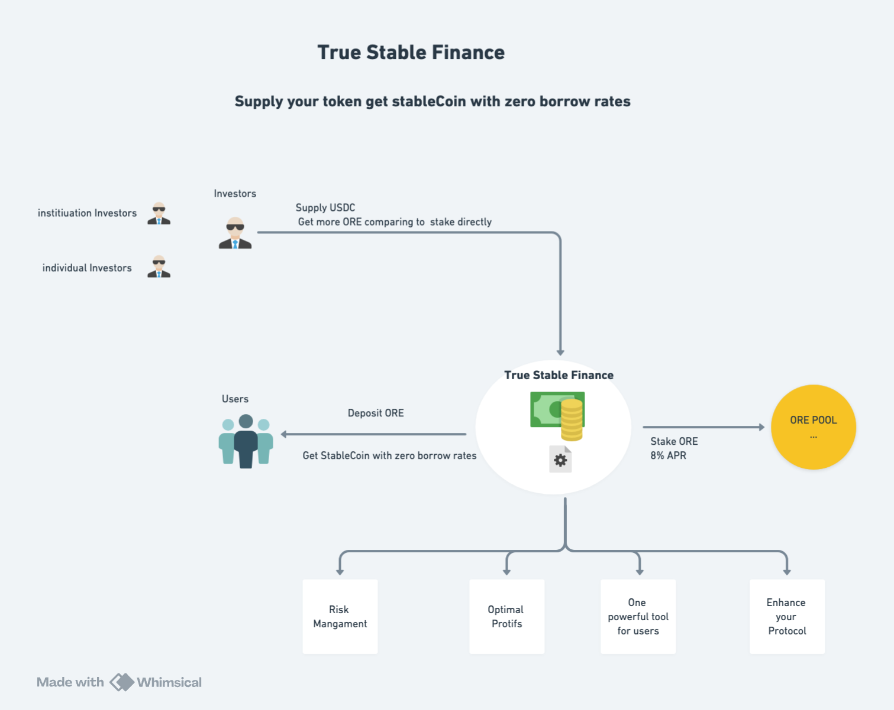

# TrueStable Finance

## Background

In the current cryptocurrency market, numerous protocol tokens face challenges in facilitating effective collaboration. Simultaneously, token holders often seek ways to optimize their capital efficiency without resorting to selling their tokens. Additionally, protocol developers and long - term supporters aim to maximize their profits. TrueStable Finance emerges as a reliable solution to address these complex issues.

For token holders, TrueStable Finance offers a unique opportunity to obtain stablecoins without divesting their tokens while enjoying the significant benefit of zero borrowing rates. This enables them to unlock the value of their tokens without losing their stake in the underlying protocol. For investors, our platform provides a more lucrative alternative compared to direct token purchases, allowing them to acquire more tokens through innovative mechanisms. For protocols, partnering with TrueStable Finance means enhancing their ecosystem by attracting more users and capital, thereby promoting long - term growth and sustainability.

## Goal

The primary objective of TrueStable Finance is to enable users to borrow stablecoins at zero interest rates by staking their tokens. Currently, users can stake their ORE tokens to obtain stablecoins, specifically USDC, with no borrowing costs, creating a win - win situation for all parties involved.

## Mechanism

The operational mechanism of TrueStable Finance is designed to ensure fairness and efficiency for all participants.

**Investor Incentives**: Investors who supply stablecoins, such as USDC, have the opportunity to acquire more ORE tokens. They can do this either by directly purchasing ORE or by staking ORE, leveraging our proprietary token accumulation mechanism to increase their holdings over time.

**User Transactions**: Users can supply their ORE tokens to the platform. Based on a pre - determined collaboration ratio, they will receive the corresponding amount of USDC. This allows users to access liquidity without selling their valuable ORE tokens.

**Token Staking and Rewards**: TrueStable Finance stakes the users' supplied ORE tokens to the ORE protocol. These reward tokens serve as a source of income, which is distributed among the investors and TrueStable Finance, creating a sustainable revenue stream for all parties.

## Participants

### 1. Users

**Deposit**: Users deposit their ORE tokens into the platform and receive the expected amount of USDC, providing them with immediate liquidity.

**Redeem**: When users wish to retrieve their ORE tokens, they can return the equivalent amount of USDC to the platform, effectively reversing the initial transaction.

### 2. Investors

Investors supply USDC to the platform and, in return, are rewarded with additional ORE tokens. This provides them with an attractive investment opportunity to grow their token portfolio.

### 3. Protocols

By integrating with TrueStable Finance, protocols can enhance their ecosystem. The increased participation of users and investors through our platform leads to greater liquidity, improved token utility, and overall ecosystem growth.

## Features

**Staking**: Users can stake their ORE tokens and instantly receive the desired amount of USDC. This staking feature allows users to unlock the value of their tokens while maintaining their long - term investment.

**Redeeming**: The redeeming process is straightforward. Users can return the USDC they borrowed and retrieve their ORE tokens, ensuring flexibility and control over their assets.

**Liquidation**: To safeguard the integrity of the platform and ensure the health of each user's collateral ratio, a liquidation mechanism is in place. In the event that a user's collateral falls below a certain threshold, a liquidation process is triggered. The liquidation caller is incentivized with an evaluation bonus, ensuring that the platform remains stable and secure.

**Supply/Claim**: Protocol shareholders or users who believe in the potential of ORE can supply USDC to the platform. In return, they have the opportunity to claim more ORE tokens, aligning their interests with the growth of the ORE ecosystem.

## Specification Design

The specification design of TrueStable Finance is currently in progress. In the upcoming phases, we will focus on developing detailed technical specifications, risk management frameworks, and user - friendly interfaces to ensure the seamless operation of our platform. This will include aspects such as security protocols, smart contract optimization, and real - time monitoring of user transactions to provide a reliable and efficient service for all users.
